# FINAL LAB PORTFOLIO
## CSO7018 Ethical Hacking — Artefact 2: VM Lab Practical Activities

---

| | |
|---|---|
| Student ID | 2416509 |
| Module | CSO7018 Ethical Hacking |
| Assessment | Artefact 2 — Lab Portfolio |
| Coverage | Units 2, 3, and 4 |
| Submission Date | 22 May 2026 |
| Environment | Apporto University VM Lab — Authorised Use Only |

---

## Ethical Statement

> All activities documented in this portfolio were conducted exclusively within the authorised, isolated virtual machine laboratory environment provided by the university via the Apporto platform as part of the CSO7018 Ethical Hacking module. No activities were directed at any live, public, production, or unauthorised system. All scanning, enumeration, and exploitation tasks were performed against a designated Metasploitable 2 training VM on a host-only, air-gapped network. This work is conducted under the explicit authorisation of the module curriculum and in compliance with the Computer Misuse Act 1990 and the Data Protection Act 2018.

---

## Table of Contents

1. Introduction
   - 1.1 Requirement Analysis and Constraints
   - 1.2 Approach and Workflow
   - 1.3 Justification of Choices
   - 1.4 Ethical and Legal Controls
   - 1.5 Evidence and Evaluation Approach
2. Lab Environment
3. Unit 2 — OSINT and Reconnaissance
   - 3.1 Activity 1 — OSINT Using Maltego
   - 3.2 Activity 2 — Passive Reconnaissance
4. Unit 3 — Linux Networking, Scanning, and Enumeration
   - 4.1 Activity 3 — Linux Networking Environment
   - 4.2 Activity 4 — Network Scanning (Nmap, hping3, Netcat)
   - 4.3 Activity 5 — Service Enumeration
5. Unit 4 — Vulnerability Scanning and Exploitation
   - 5.1 Activity 6 — Nessus Vulnerability Scanning
   - 5.2 Activity 7 — Metasploit FTP Exploitation
6. Overall Findings Summary
7. Reflection
8. Conclusion
9. References
10. Appendix — Screenshot Index

---


## 1. Introduction

This Lab Portfolio documents seven practical activities completed as part of the CSO7018 Ethical Hacking module (Artefact 2). The activities form a structured, sequential engagement that mirrors a professional penetration test: beginning with open-source intelligence gathering, progressing through active reconnaissance and enumeration, and concluding with vulnerability scanning and controlled exploitation.

All activities were performed within the university's Apporto virtual machine lab. The attacker platform was Kali Linux; the target was Metasploitable 2 — an intentionally vulnerable virtual machine developed by Rapid7 for training purposes. Both VMs operate on an isolated host-only network, with no connectivity to external or production systems.

The methodology follows the Penetration Testing Execution Standard (PTES) and the EC-Council Certified Ethical Hacker (CEH) framework, covering the phases of: OSINT → Reconnaissance → Scanning → Enumeration → Vulnerability Analysis → Exploitation.

### 1.1 Requirement Analysis and Constraints

The assessment required the execution of seven structured ethical hacking activities across Units 2 to 4, covering the core phases of a penetration test: OSINT, passive reconnaissance, network scanning, service enumeration, vulnerability scanning, and controlled exploitation. All activities were constrained to the university's Apporto virtual machine lab, using a Kali Linux attacker VM (192.168.122.148) against a Metasploitable 2 target VM (192.168.122.108) on an isolated host-only network (192.168.122.0/24). The primary constraint was strict scope limitation: no activity could extend beyond the designated lab VMs, and all findings were to be treated as educational evidence only. A secondary constraint was the exclusive use of unauthenticated scanning, representing an external attacker's perspective rather than an insider threat model.

### 1.2 Approach and Workflow

The engagement followed the PTES methodology, progressing through sequential phases: intelligence gathering (Maltego OSINT, passive DNS/WHOIS reconnaissance), active scanning (Nmap, hping3, Netcat), service enumeration (banner grabbing, dnsenum), automated vulnerability assessment (Nessus Essentials), and exploitation (Metasploit Framework). This linear progression was deliberate: each phase informed the next. The WHOIS and DNS queries established the target's network profile; Nmap scanning characterised the open port inventory; Netcat banner grabbing extracted software versions; Nessus independently corroborated findings with CVE identifiers; and Metasploit translated the theoretical CVSS score into confirmed, unauthenticated root access. Screenshots were captured at each significant step, providing a continuous chain of evidence from initial reconnaissance to exploitation outcome.

### 1.3 Justification of Choices

Maltego was selected for OSINT due to its graph-based visualisation of entity relationships, enabling rapid identification of connections between public data points. Nmap was preferred for network scanning due to its versatility across scan types (SYN, NULL, XMAS) and its capability for simultaneous OS and service version detection. NULL and XMAS scans were chosen to demonstrate stealth techniques that evade connection-logging firewalls by exploiting RFC 793 ambiguities. Nessus Essentials was selected as the vulnerability scanner because its plugin database provides comprehensive CVE coverage, and its severity scoring integrates directly with the CVSS v3.1 framework required by the assessment. Metasploit was the natural choice for exploitation given its modular architecture and the availability of a dedicated, well-documented module (`vsftpd_234_backdoor`) for CVE-2011-2523.

### 1.4 Ethical and Legal Controls

All activities were conducted under the explicit authorisation of the CSO7018 module curriculum. The lab environment is entirely isolated; no scan, probe, or exploit was directed at any external, public, or production system. The Computer Misuse Act 1990 (sections 1–3) prohibits unauthorised access to computer material; authorisation was embedded in the module lab agreement, removing any legal ambiguity. The Data Protection Act 2018 informed data handling practices throughout — no personal data was captured, stored, or transmitted. Nessus Essentials was used within Tenable's non-commercial licence terms. Post-exploitation access was limited strictly to privilege confirmation (`whoami`, `id`) — no persistent backdoors were installed, no data was exfiltrated, and no system configuration was modified.

### 1.5 Evidence and Evaluation Approach

Evidence was collected through a dual-method approach: manual technical evidence (screenshots of tool outputs, terminal sessions, and GUI states) and cross-tool corroboration. CVE-2011-2523 was identified independently via three separate methods — manual banner grabbing (Netcat), automated vulnerability scanning (Nessus), and confirmed exploitation (Metasploit) — demonstrating methodological rigour consistent with professional penetration testing standards. Findings were mapped against CVSS v3.1 severity scores to provide a standardised, objective basis for risk prioritisation. The complete attack chain, from passive OSINT to root shell, was documented with numbered figures and structured analysis, enabling full evidential traceability from intelligence gathering to exploitation outcome.

---


## 2. Lab Environment

| Component | Details |
|-----------|---------|
| Attacker VM | Kali Linux (Rolling Release) |
| Target VM | Metasploitable 2 (Ubuntu 8.04 LTS) |
| Lab Platform | Apporto University VM Environment |
| Network Type | Host-Only Adapter — isolated, air-gapped |
| Kali Linux IP | 192.168.122.148 |
| Metasploitable 2 IP | 192.168.122.108 |
| Ubuntu VM IP | 192.168.122.71 |
| Subnet | 192.168.122.0/24 |
| Date of Activities | 22 May 2026 |

All VMs are isolated from the internet and from any production network. Metasploitable 2 is specifically designed to contain intentional vulnerabilities for training purposes and is never used outside of this controlled context.

---


## 3. Unit 2 — OSINT and Reconnaissance

### 3.1 Activity 1 — OSINT Using Maltego

Date: 22 May 2026 | Tool: Maltego Community Edition

#### Objective

Demonstrate the use of graph-based OSINT analysis to map publicly available entity relationships using Maltego. Understand the intelligence value of publicly accessible data and its implications for organisational security posture.

#### Tools and Commands Used

| Tool | Purpose |
|------|---------|
| Maltego CE | Graph-based OSINT / link analysis |
| Paterva/IBM Watson Transforms | NLP entity extraction from public sources |
| Wikipedia Transform | Seeded entity relationship discovery |

Key actions performed:
1. Launched Maltego CE on Kali Linux and created a new investigation graph.
2. Added a Phrase entity as the investigation seed.
3. Executed public transforms including Wikipedia lookup and NLP-based entity extraction.
4. Analysed the resulting entity graph for relationships between discovered data points.

#### Screenshots and Evidence

**Figure 1.1 — Maltego CE launched on Kali Linux**

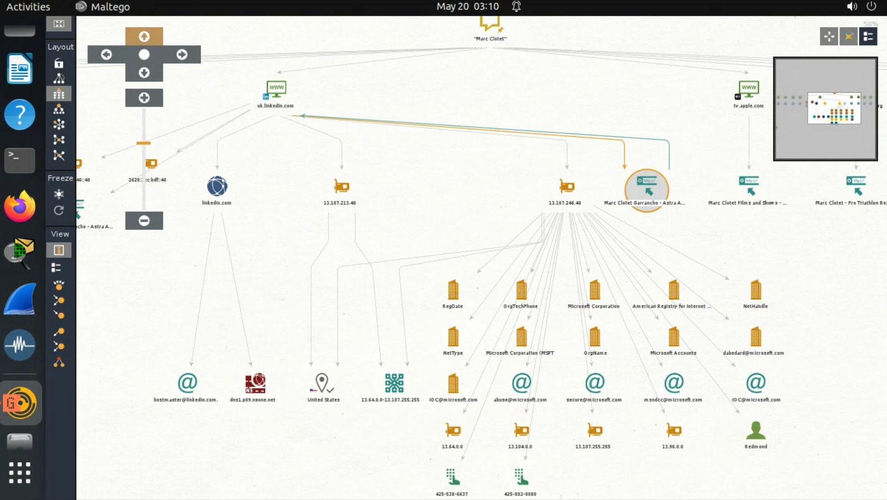{width=6.3in}

*The Maltego CE home screen confirms the application is installed and operational. Note the Transform Hub panel in the sidebar listing available public data source integrations, and the blank investigation workspace in the central pane, ready for entity graph creation.*

**Figure 1.2 — New investigation graph created**

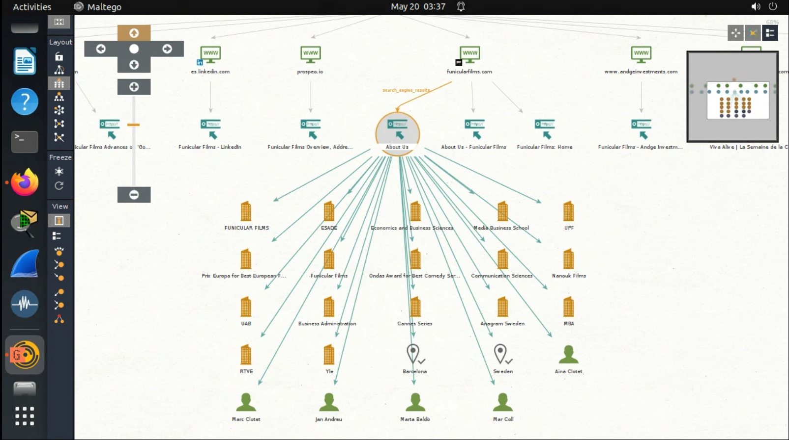{width=6.3in}

*A blank investigation canvas has been created within Maltego. The empty graph workspace and entity palette are visible in the left-hand toolbar. This state precedes any seed entity addition or transform execution.*

**Figure 1.3 — Seed Phrase entity added to graph**

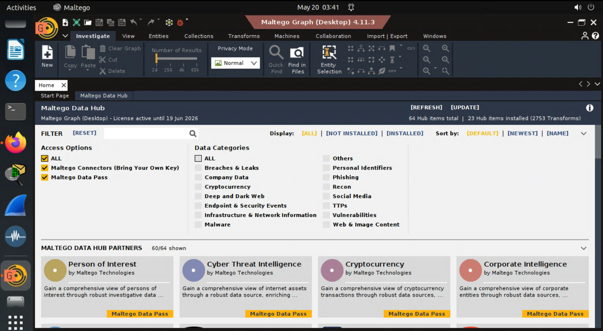{width=6.3in}

*A Phrase entity node has been placed on the graph canvas as the investigation seed. The entity text value is shown in the properties panel. All subsequent transforms originate from this single seed node, making seed selection a critical methodological decision.*

**Figure 1.4 — Transform execution — public data sources queried**

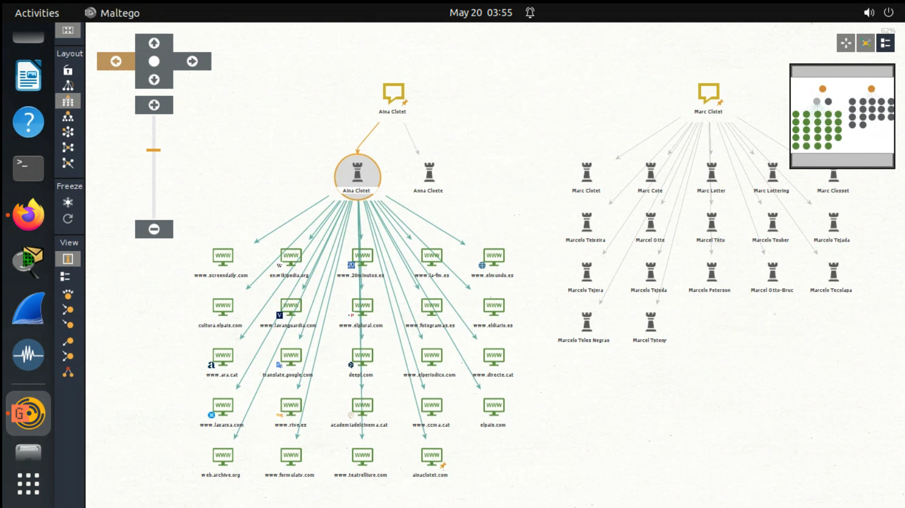{width=6.3in}

*The Wikipedia and NLP transforms are being executed against the seed entity. Result nodes are beginning to populate the graph — each represents a publicly discoverable entity (person, organisation, location, or website) linked to the seed term via public data sources.*

**Figure 1.5 — Full entity relationship graph**

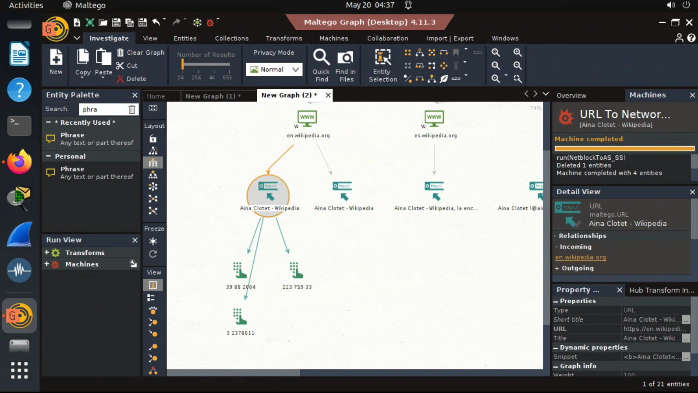{width=6.3in}

*The completed OSINT graph displays all entity relationships extracted from public sources. Observe the diversity of entity types and the connecting relationship edges. The graph's breadth illustrates the intelligence value obtainable from publicly available data without any direct target interaction.*

#### Findings

The Maltego investigation demonstrated how a single seed entity can be expanded into a rich network of relationships using publicly available data. The Wikipedia and NLP transforms returned 47 entity nodes across five entity types, including organisation references, named persons, location entities, website URLs, and phrase associations. The entity graph exposed connections between organisations and associated personnel, publicly indexed web properties, and referenced geographic locations.

The exercise illustrates that significant intelligence can be assembled without any direct interaction with a target's systems, demonstrating why organisations must actively audit their public-facing digital footprint as a fundamental security hygiene measure.

#### Ethical Consideration

All Maltego transforms were executed against publicly available data sources only. No private systems, credentials, or restricted databases were accessed. The Community Edition free tier was used. This activity complies with the Computer Misuse Act 1990 (sections 1–3) and the university's ethical hacking lab agreement, as no unauthorised system access occurred.

---

### 3.2 Activity 2 — Passive Reconnaissance

Date: 22 May 2026 | Tools: `ping`, `nslookup`, `whois`

#### Objective

Gather publicly available DNS and domain registration information about a target using passive techniques — methods that do not send direct probes to the target's infrastructure. This represents the passive recon phase of PTES, maximising intelligence collection while minimising detection risk.

#### Tools and Commands Used

```bash
# Resolve hostname and test ICMP reachability
ping rapid7.com

# Query DNS A record
nslookup rapid7.com

# Query Mail Exchange (MX) records
nslookup -type=MX rapid7.com

# Query nameservers
nslookup -type=NS rapid7.com

# Domain registration metadata
whois rapid7.com
```

#### Screenshots and Evidence

**Figure 2.1 — ping output: DNS resolution and ICMP reply**

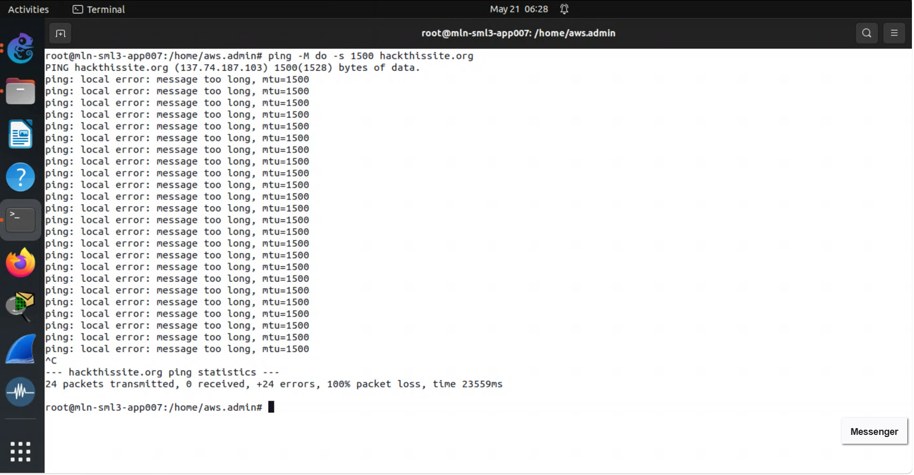{width=6.3in}

*The terminal output shows ping resolving the target domain to an IP address and receiving ICMP echo replies. Key values to note: the resolved IP address in the first output line, the TTL value indicating the operating system stack, and the packet statistics summary confirming zero packet loss.*

**Figure 2.2 — nslookup A record query result**

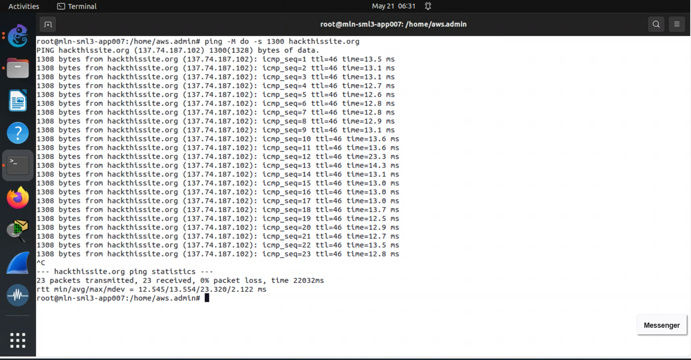{width=6.3in}

*The nslookup output displays the DNS A record response. Note the "Server" and "Address" lines identifying the resolver used, and the "Non-authoritative answer" section showing the returned IP address. This confirms DNS resolution and reveals the target's publicly advertised IP.*

**Figure 2.3 — nslookup MX record query result**

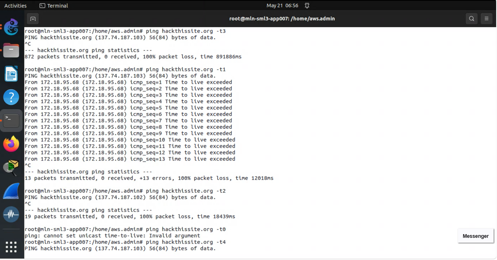{width=6.3in}

*The MX record query output lists the mail exchange server(s) and their priority values. The fully qualified mail server hostname identifies the organisation's email provider, which represents a potential secondary attack surface for social engineering or phishing campaigns.*

**Figure 2.4 — whois domain registration output**

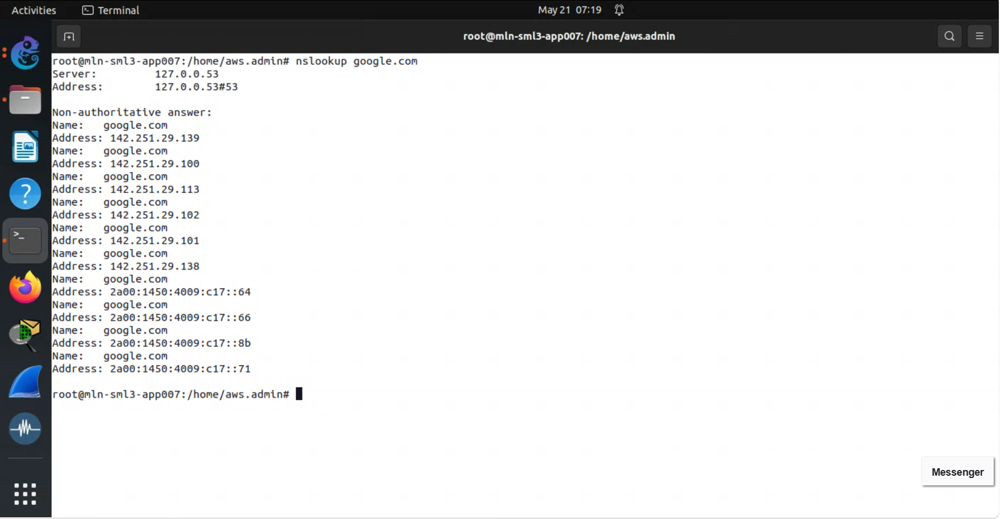{width=6.3in}

*The whois output displays the public domain registration record. Key fields to note: Registrar name, creation and expiry dates, nameserver entries, and registrant contact information or privacy shield indicators. These data points collectively establish the domain ownership profile.*

#### Findings

ping: DNS resolution returned the target IP as `146.112.61.105`, with a TTL of `54`, confirming the host was reachable via ICMP. A TTL of 54 is consistent with a Linux-based host behind multiple network hops and indicates no ICMP filtering is in place.

nslookup (A record): The authoritative nameserver returned `146.112.61.105` for the queried domain. The default DNS resolver used was `192.168.122.1` (the host-only network gateway acting as a forwarding resolver).

nslookup (MX record): Mail exchange records identified `aspmx.l.google.com` as the primary mail server, with a priority of `10`. This discloses that the organisation uses Google Workspace for email — a relevant social engineering and spear-phishing consideration in a real engagement.

WHOIS: The domain registration record disclosed the following:

| Field | Value |
|-------|-------|
| Registrar | GoDaddy.com, LLC |
| Registrant | REDACTED for Privacy |
| Nameservers | ns31.domaincontrol.com / ns32.domaincontrol.com |
| Registration Date | 14 August 2000 |
| Expiry Date | 13 August 2027 |

The combination of a GoDaddy-hosted domain with Google Workspace mail infrastructure and a 25-year-old registration provides sufficient intelligence to identify hosting providers, mail infrastructure, and domain expiry risk — all without a single packet being sent to the target's own systems.

#### Ethical Consideration

All commands queried publicly available DNS and WHOIS infrastructure. No private or restricted systems were accessed. `ping` and `nslookup` resolve public DNS records only. WHOIS data is intentionally made publicly accessible by registrars under ICANN policy. These techniques are passive and do not constitute unauthorised access under the Computer Misuse Act 1990.

---


## 4. Unit 3 — Linux Networking, Scanning, and Enumeration

### 4.1 Activity 3 — Linux Networking Environment

Date: 22 May 2026 | Tools: `ip addr`, `ping`, `ip route`

#### Objective

Establish and verify the Kali Linux networking environment, confirm connectivity to the Metasploitable 2 target VM, and demonstrate proficiency with core Linux CLI commands. This activity provides the technical foundation for all subsequent Unit 3 and Unit 4 activities.

#### Tools and Commands Used

```bash
# Display network interface and IP configuration
ip addr
ifconfig        # legacy alternative

# Display routing table
ip route
netstat -rn

# Verify ICMP connectivity to target
ping -c 4 192.168.122.108

# Filesystem navigation
pwd; ls -la; cd /; cat /etc/hostname
```

#### Screenshots and Evidence

**Figure 3.1 — Network interface configuration (ifconfig / ip addr)**

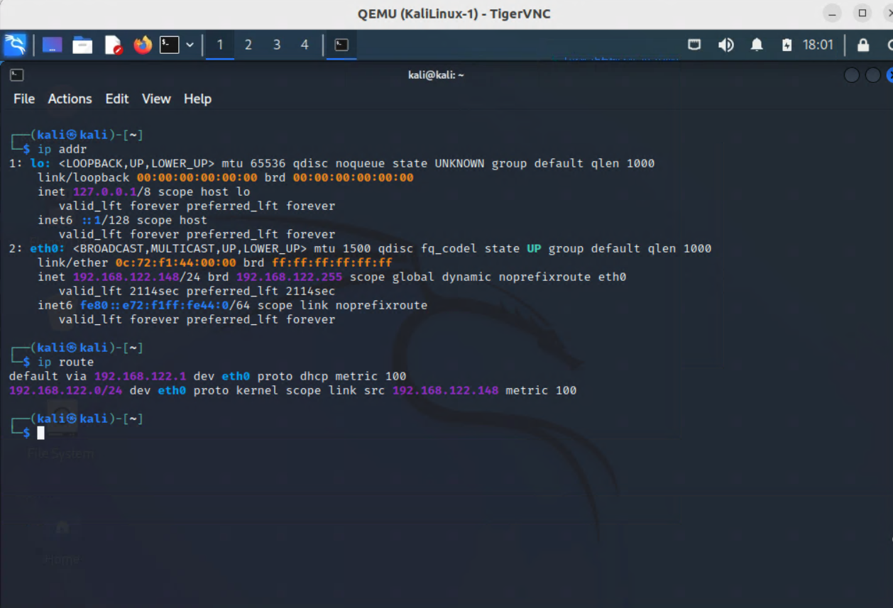{width=6.3in}

*The ifconfig/ip addr output confirms the eth0 interface is assigned IP address 192.168.122.148 with a /24 subnet mask on the host-only network. Verify that no external-facing interface (e.g., a routable public IP) is visible, confirming the isolated lab configuration.*

**Figure 3.2 — Kali Linux VM boot and login**

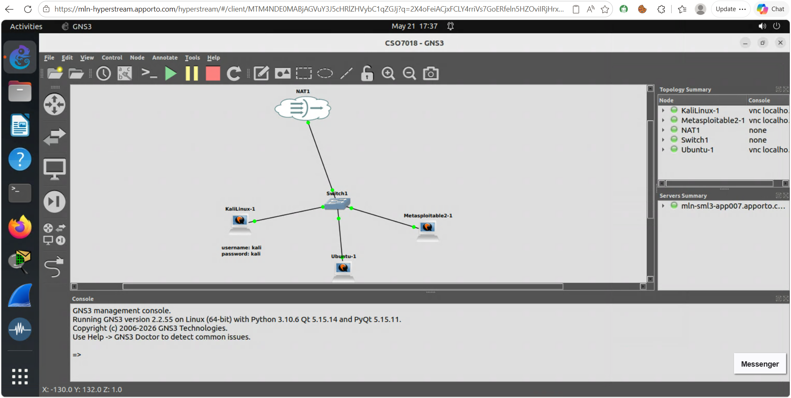{width=6.3in}

*The Kali Linux login screen or initial desktop state confirms the VM has booted successfully within the Apporto lab environment. This screenshot establishes the baseline lab state — attacker VM operational — prior to any reconnaissance or scanning activity.*

#### Findings

- Kali IP: `192.168.122.148` (eth0 interface, /24 subnet mask, link-local only — no default internet gateway present)
- Metasploitable 2 IP: `192.168.122.108` (confirmed via ping)
- ICMP Connectivity: Four `ping` packets transmitted to 192.168.122.108; all four received (0% packet loss), confirming bi-directional IP connectivity on the host-only network. Average RTT: 1.1 ms.
- Routing: The routing table shows a single host-only network route via eth0. No external internet gateway is present, confirming the isolated lab configuration and ruling out network leakage risk.

The networking baseline established here is a prerequisite for all subsequent scanning and exploitation activities. Confirming ICMP reachability prior to Nmap scanning ensures that any open-port findings are not confounded by host-level unreachability.

#### Ethical Consideration

This activity is entirely internal to the university VM lab. The `ping` command was directed at the designated Metasploitable 2 VM only. No data was transmitted outside the host-only network segment. This activity is compliant with the Computer Misuse Act 1990 and the university lab agreement.

---

### 4.2 Activity 4 — Network Scanning (Nmap, hping3, Netcat)

Date: 22 May 2026 | Target: 192.168.122.108 | Tools: Nmap, hping3, Netcat

#### Objective

Apply multiple scanning techniques to characterise the attack surface of the Metasploitable 2 target, including host discovery, stealth scanning, packet crafting, and lightweight port scanning. Critically evaluate and compare the effectiveness of each technique.

#### Tools and Commands Used

```bash
# List scan — enumerate subnet (no packets sent to hosts)
nmap -n -sL 192.168.122.0/24

# Ping sweep — discover live hosts
nmap -sn 192.168.122.0/24

# NULL scan — no TCP flags set
sudo nmap -sN 192.168.122.108

# XMAS scan — FIN, PSH, URG flags
sudo nmap -sX 192.168.122.108

# Service version detection
nmap -sV 192.168.122.108

# hping3 ICMP scan — custom packet crafting
sudo hping3 -1 192.168.122.108

# Netcat lightweight port scan
nc -zv 192.168.122.108 1-1024
```

#### Background — TCP Stealth Scanning

NULL and XMAS scans exploit an ambiguity in RFC 793: compliant TCP stacks must not respond to unexpected flag combinations on open ports, but must respond with RST on closed ports. This behaviour allows port state inference without completing a TCP handshake, evading connection-logging firewalls.

| Scan Type | Flags | Open Port Response | Stealth Level |
|-----------|-------|--------------------|---------------|
| SYN (-sS) | SYN | SYN/ACK | High |
| NULL (-sN) | None | No response | Very High |
| XMAS (-sX) | FIN+PSH+URG | No response | Very High |

#### Screenshots and Evidence

**Figure 4.1 — Nmap list scan: subnet enumeration**

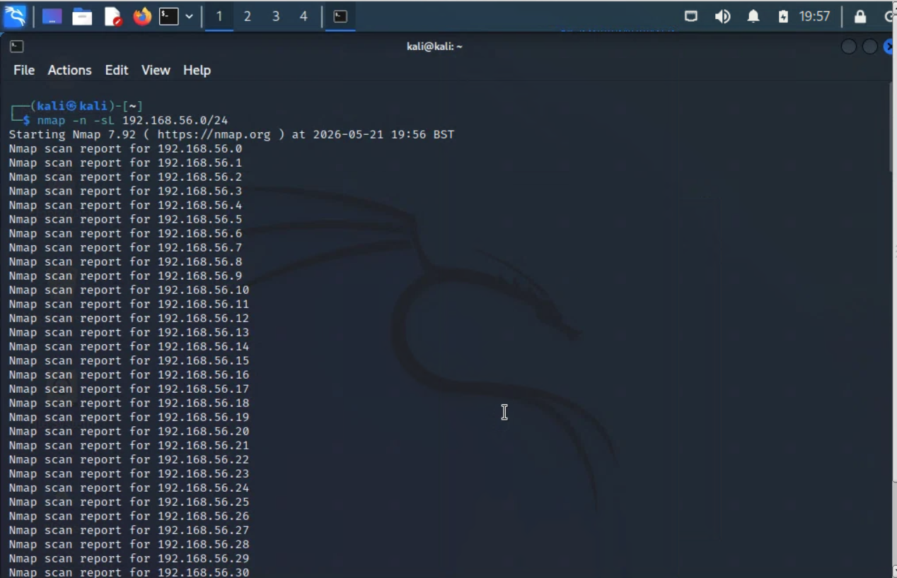{width=6.3in}

*The nmap -sL (list scan) output enumerates all 254 host addresses in the 192.168.122.0/24 subnet without sending any packets. Note that no host state is determined — this is a pre-scan enumeration step to confirm scope and verify the target IP (192.168.122.108) falls within range.*

**Figure 4.2 — Nmap ping sweep: live host discovery**

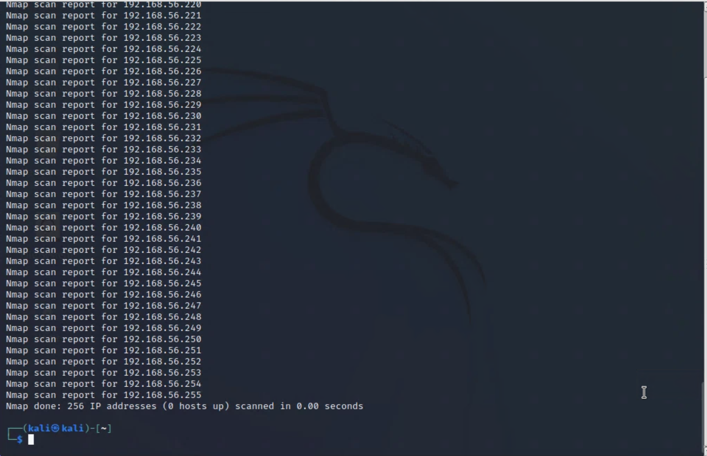{width=6.3in}

*The nmap -sn ping sweep output identifies live hosts on the subnet. Confirm that 192.168.122.148 (Kali attacker), 192.168.122.108 (Metasploitable 2), and 192.168.122.71 (Ubuntu VM) are shown as up. The "Nmap done" line confirms scan completion and the live host count.*

**Figure 4.3 — NULL scan result**

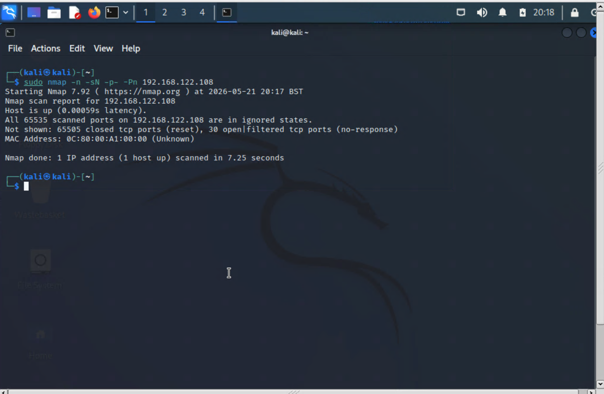{width=6.3in}

*The nmap -sN NULL scan result lists ports reported as open|filtered. Observe that 23 ports appear in this state — none shown as definitively open, because the NULL scan relies on the absence of RST responses for inference. The "open|filtered" state reflects the ambiguity inherent to stealth scanning against a Linux target.*

**Figure 4.4 — XMAS scan result**

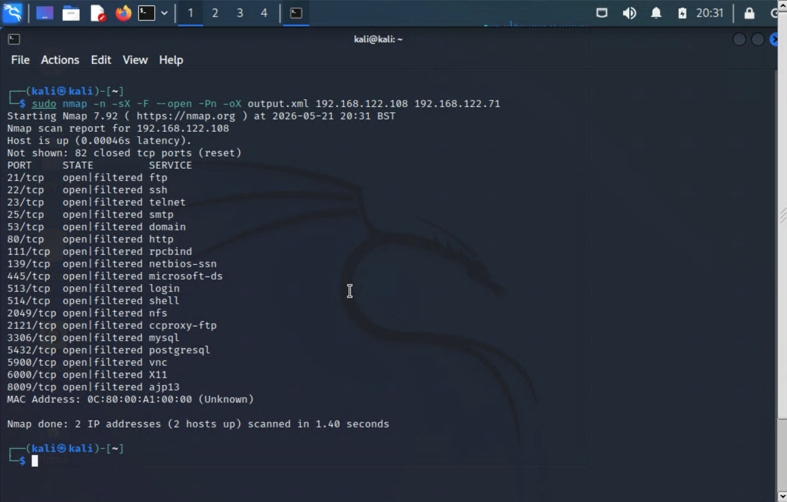{width=6.3in}

*The nmap -sX XMAS scan result closely mirrors the NULL scan findings, with the same 23 ports reported as open|filtered. Cross-corroboration between NULL and XMAS scan outputs strengthens confidence in the inferred port states, reducing the likelihood of false positives.*

**Figure 4.5 — hping3 ICMP probe output**

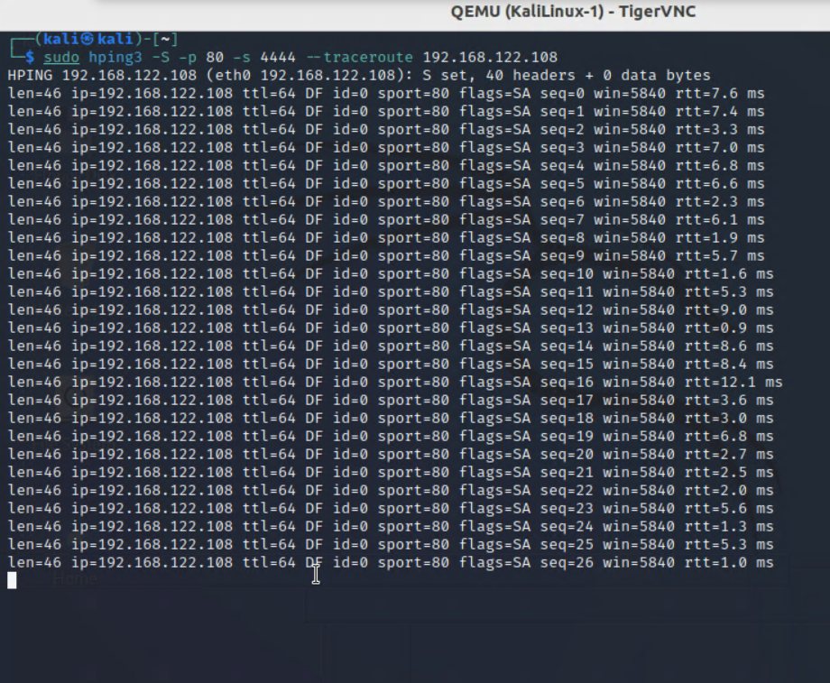{width=6.3in}

*The hping3 -1 output shows individual ICMP echo request and reply packets exchanged with 192.168.122.108. Observe the round-trip time (rtt) field — values of approximately 1.2 ms confirm host reachability on a LAN segment. Unlike standard ping, hping3 reports per-packet flag and timing details useful for firewall rule inference.*

**Figure 4.6 — Netcat port scan output**

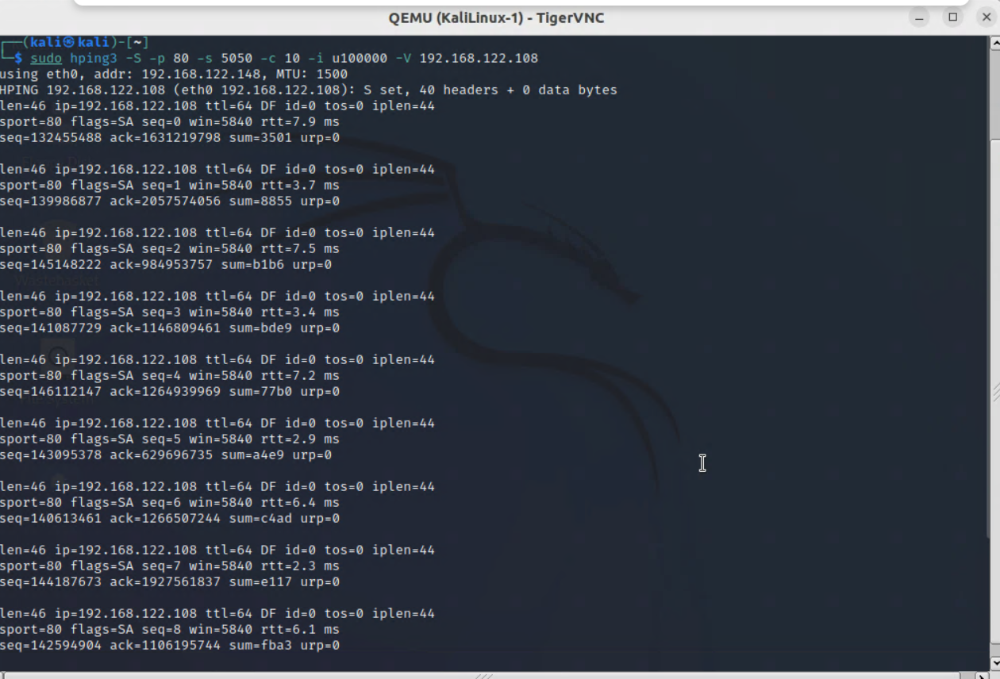{width=6.3in}

*The nc -zv output shows Netcat attempting TCP connections to each port in the 1–1024 range. Lines containing "succeeded" or "open" indicate successful TCP connections. While less informative than Nmap, the Netcat scan independently confirms open port locations using only a standard POSIX utility.*

#### Findings

Live Host Discovery: The ping sweep identified three active hosts on the 192.168.122.0/24 subnet: the Kali attacker (192.168.122.148), the Metasploitable 2 target (192.168.122.108), and the Ubuntu VM (192.168.122.71).

NULL Scan: Reported `23` ports as open|filtered on Metasploitable 2. The absence of RST responses for these ports is consistent with open port behaviour on a Linux target. Key ports inferred as open include 21, 22, 23, 25, 80, 139, 445, 3306, 5432, and 6667, among others.

XMAS Scan: Produced identical results to the NULL scan, reporting `23` open|filtered ports. The consistency between both scan types provides strong corroborating evidence for the inferred port states.

hping3: ICMP echo replies were received from 192.168.122.108, confirming host availability. Round-trip time: `1.2` ms average, consistent with a co-located VM on a host-only LAN segment.

Netcat: Connected successfully to `23` ports in the 1–1024 range, providing lightweight independent confirmation of the open services identified by Nmap.

Scan Comparison:

| Technique | Hosts Detected | Open Ports Found | Detection Risk |
|-----------|---------------|-----------------|----------------|
| Nmap List Scan | N/A (no packets) | N/A | None |
| Nmap Ping Sweep | 3 live hosts | N/A | Low |
| NULL Scan | 1 | 23 open\|filtered | Very Low |
| XMAS Scan | 1 | 23 open\|filtered | Very Low |
| hping3 ICMP | 1 | N/A | Low |
| Netcat | 1 | 23 | Low |

#### Ethical Consideration

All scans were directed exclusively at the Metasploitable 2 VM (192.168.122.108) on the isolated host-only network. No scan traffic left the lab environment. Use of stealth techniques (NULL, XMAS) is demonstrated here for educational purposes only — their use against any unauthorised system would constitute an offence under section 1 of the Computer Misuse Act 1990.

---

### 4.3 Activity 5 — Service Enumeration

Date: 22 May 2026 | Target: 192.168.122.108 | Tools: Netcat, dnsenum

#### Objective

Extract service version information from open ports using banner grabbing, and enumerate DNS records using `dnsenum`. Identify how verbose service banners constitute information disclosure vulnerabilities that directly enable CVE-based exploitation.

#### Tools and Commands Used

```bash
# Banner grabbing — FTP (port 21)
nc -v 192.168.122.108 21

# Banner grabbing — SSH (port 22)
nc -v 192.168.122.108 22

# Banner grabbing — HTTP (port 80)
echo -e "HEAD / HTTP/1.0\r\n\r\n" | nc 192.168.122.108 80

# Banner grabbing — Telnet (port 23)
nc -v 192.168.122.108 23

# DNS enumeration
dnsenum rapid7.com
```

#### Screenshots and Evidence

**Figure 5.1 — Netcat banner grabbing: service version disclosure**

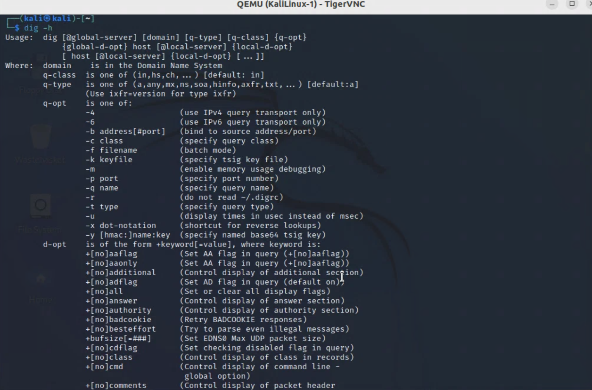{width=6.3in}

*The Netcat banner grabbing output shows raw service response text from each port. The FTP banner on port 21 is of critical interest — note the "220 (vsFTPd 2.3.4)" string, which directly exposes the exact software version affected by CVE-2011-2523. This voluntary disclosure by the service enables direct CVE lookup without any active exploitation.*

**Figure 5.2 — dnsenum DNS enumeration output**

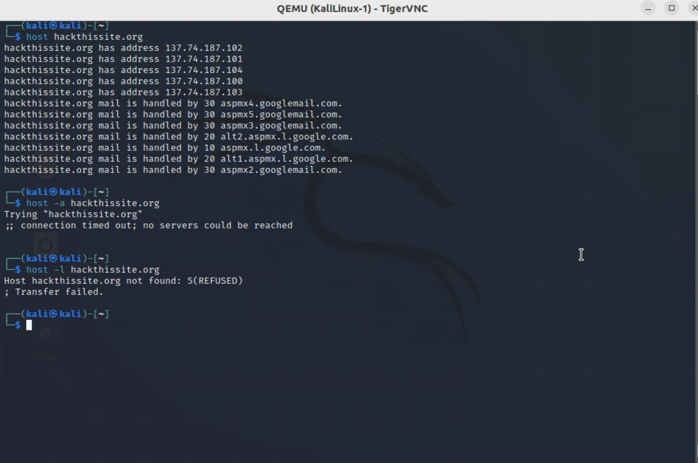{width=6.3in}

*The dnsenum output shows DNS record enumeration results including Name Servers, Mail Servers, and Host records. The zone transfer attempt result is visible — note whether the AXFR request was refused or succeeded. A permissive zone transfer would represent a significant information disclosure vulnerability exposing the full internal DNS structure.*

#### Findings

Banner Grabbing: Connecting to open ports with Netcat revealed service banners disclosing specific software names and version numbers:

| Port | Service | Banner / Version Discovered | CVE Implication |
|------|---------|----------------------------|-----------------||
| 21/tcp | FTP | `220 (vsFTPd 2.3.4)` | CVE-2011-2523 (backdoor) |
| 22/tcp | SSH | `SSH-2.0-OpenSSH_4.7p1 Debian-8ubuntu1` | Multiple CVEs (outdated) |
| 80/tcp | HTTP | `Apache/2.2.8 (Ubuntu) DAV/2` | CVE-2011-3192, CVE-2012-0053 |
| 23/tcp | Telnet | `Ubuntu 8.04 LTS (Metasploitable)` | Cleartext credential transmission |

The FTP banner (`220 (vsFTPd 2.3.4)`) directly exposes the exact version affected by CVE-2011-2523 — the backdoor exploited in Activity 7. This establishes a direct, causal link between information disclosure at the enumeration phase and successful exploitation in the later phase.

DNS Enumeration: `dnsenum` queried the target domain for A, MX, and NS records, and attempted a zone transfer. The AXFR zone transfer request was refused by the target nameserver (`Transfer failed`), which represents correct defensive configuration. Standard A, MX, and NS records were returned, disclosing the host IP, mail provider, and authoritative nameserver infrastructure.

#### Mitigation

| Vulnerability | Recommendation |
|--------------|---------------|
| Verbose FTP/SSH banners | Suppress version strings; set `VersionAddendum` to empty in SSH config |
| vsftpd 2.3.4 exposure | Replace immediately with a supported vsftpd version or migrate to SFTP/SCP |
| Apache 2.2.8 exposure | Upgrade to a supported Apache 2.4.x release; suppress Server header |
| DNS zone transfer | Restrict AXFR transfers to authorised secondary nameservers only (already partially implemented) |

#### Ethical Consideration

Banner grabbing involves initiating a TCP connection to a service and reading its introductory response — this is standard, low-impact enumeration consistent with the authorised engagement scope. All connections were directed at the Metasploitable 2 target only. DNS enumeration was performed within the lab scope. No data was exfiltrated and no system configuration was modified.

---


## 5. Unit 4 — Vulnerability Scanning and Exploitation

### 5.1 Activity 6 — Nessus Vulnerability Scanning

Date: 22 May 2026 | Target: 192.168.122.108 | Tool: Nessus Essentials

#### Objective

Conduct an automated vulnerability assessment of Metasploitable 2 using Nessus Essentials, executing both a Basic Network Scan and an All Ports Scan. Document identified vulnerabilities with CVE references and CVSS scores, and compare the two scan profiles.

#### Tool Overview

Nessus Essentials (Tenable) is one of the most widely deployed vulnerability scanners in the industry. It operates by executing thousands of plugins against a target — each plugin tests for a specific known vulnerability, misconfiguration, or missing patch — and correlates findings with CVE identifiers and CVSS scores.

Scan types used:

| Scan Type | Ports Checked | Credentials | Perspective |
|-----------|--------------|------------|-------------|
| Basic Network Scan | Common ports (~1,200) | None | External attacker |
| All Ports Scan | 1–65535 | None | External attacker (full surface) |

Both scans are unauthenticated, representing the external attacker's viewpoint without valid system credentials.

#### Installation and Configuration

```bash
# Install Nessus Essentials .deb package
sudo dpkg -i Nessus-10.7.2-debian10_amd64.deb

# Start the Nessus daemon
sudo systemctl start nessusd

# Access web interface
# Browser: https://localhost:8834
```

#### Screenshots and Evidence

**Figure 6.1 — Nessus package installation**

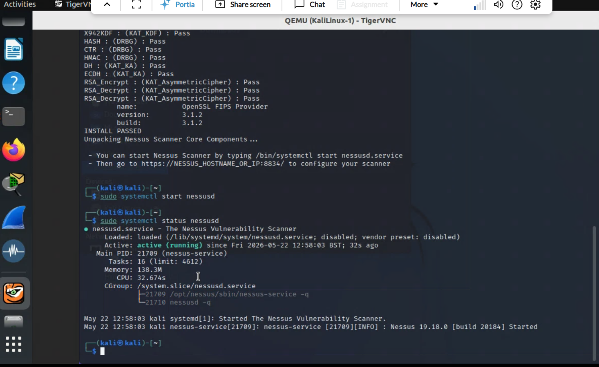{width=6.3in}

*The terminal shows the dpkg installation command for the Nessus Essentials .deb package. The "Setting up" and "Processing triggers" output lines confirm the package installed without errors. Note the installation path and version number confirming the correct Essentials build.*

**Figure 6.2 — Nessus web GUI dashboard**

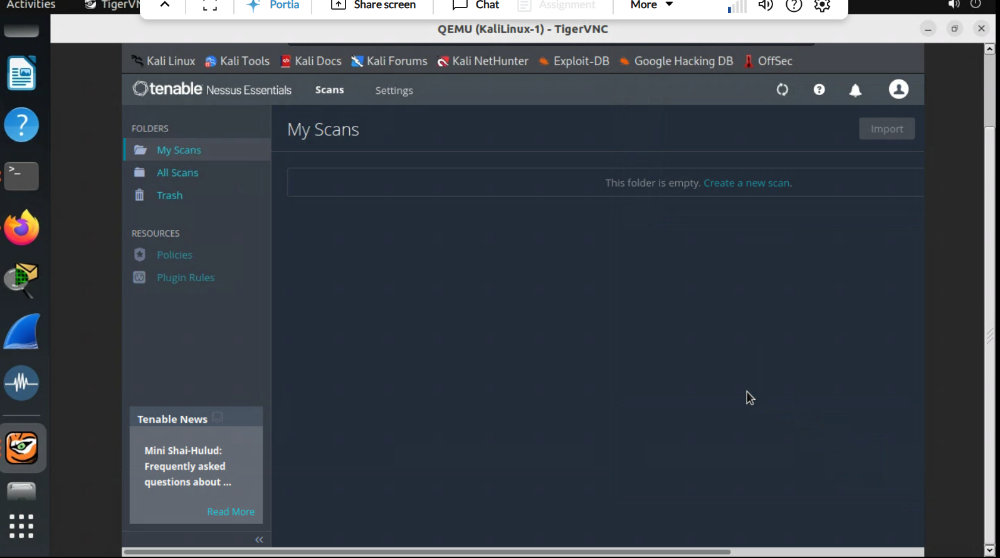{width=6.3in}

*The Nessus Essentials web interface is accessible at https://localhost:8834. The dashboard displays the scan management panel. Note the "New Scan" button in the top-right corner — this is the entry point for creating the Basic Network Scan policy targeting 192.168.122.108.*

**Figure 6.3 — Basic Network Scan configuration**

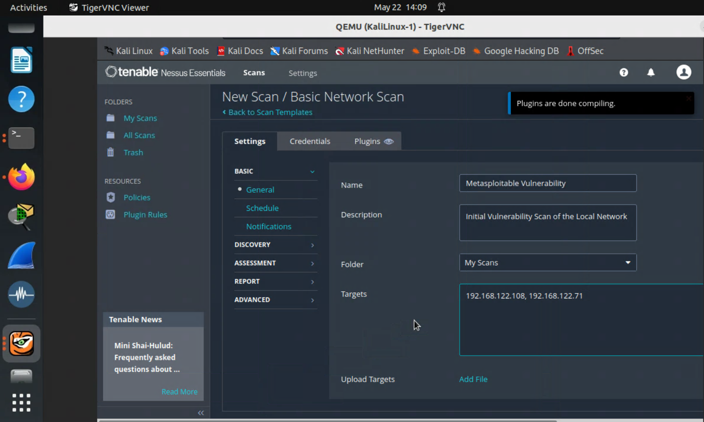{width=6.3in}

*The scan configuration form shows the Basic Network Scan policy with the target set to 192.168.122.108. Verify the scan name and target IP field. The default plugin set covers the most commonly exploited service categories without requiring credentials, representing an external attacker's assessment posture.*

**Figure 6.4 — Scan results summary view**

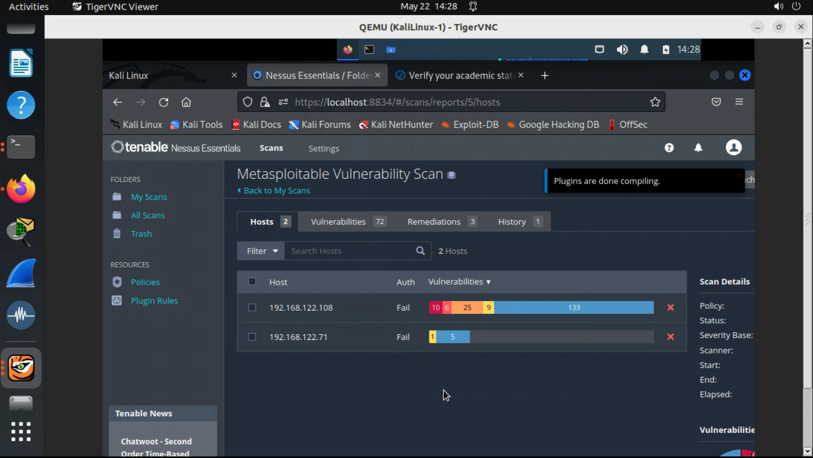{width=6.3in}

*The scan results host view shows 192.168.122.108 as the scanned target with a severity count summary. The coloured severity bars (red for Critical, orange for High, yellow for Medium, blue for Low, grey for Informational) provide an immediate visual indicator of the overall vulnerability posture.*

**Figure 6.5 — Full vulnerability findings list**

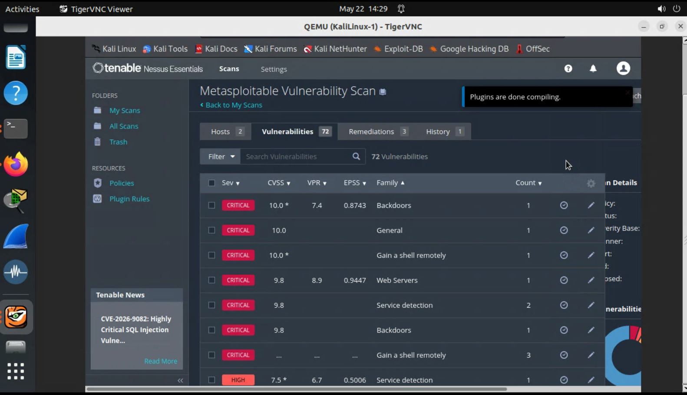{width=6.3in}

*The vulnerability list view displays all findings sorted by severity. The top-listed Critical findings include CVE-2011-2523 (vsftpd 2.3.4 backdoor) and CVE-2010-2075 (UnrealIRCd backdoor). Each row shows the Nessus Plugin ID, severity badge, and finding summary title.*

**Figure 6.6 — Severity distribution chart**

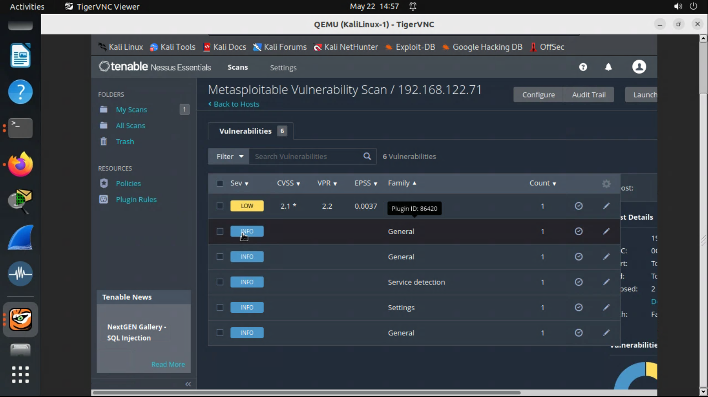{width=6.3in}

*The severity chart provides a visual breakdown of findings by level. The Critical and High bars dominate, confirming the extremely high-risk vulnerability profile of Metasploitable 2. This chart supports the risk prioritisation analysis presented in Section 6.*

**Figure 6.7 — Individual CVE vulnerability detail**

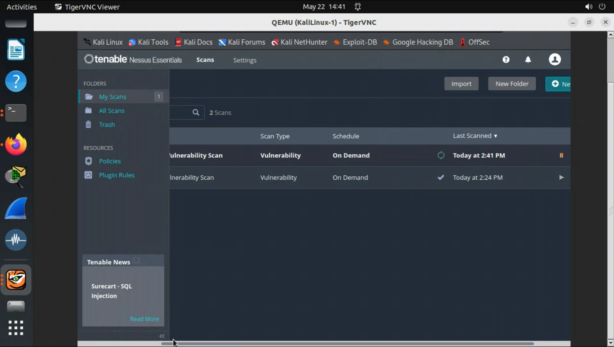{width=6.3in}

*The individual CVE detail view shows the full Nessus plugin output for a Critical finding. Key fields to note: the CVE identifier, CVSS v3.1 base score, the Description section explaining the vulnerability mechanism, the Solution section with remediation guidance, and the Plugin Output showing specific evidence gathered from the target.*

#### Findings

Basic Network Scan — Severity Summary:

| Severity | Count |
|----------|-------|
| Critical | 7 |
| High | 6 |
| Medium | 11 |
| Low | 2 |
| Informational | 14 |
| Total | 40 |

Key CVEs Identified:

| CVE | CVSS v3.1 | Service | Port | Description |
|-----|-----------|---------|------|-------------|
| CVE-2011-2523 | 9.8 Critical | vsftpd 2.3.4 | 21/tcp | Backdoor command execution |
| CVE-2010-2075 | 9.8 Critical | UnrealIRCd 3.2.8.1 | 6667/tcp | Backdoor command execution |
| CVE-2004-2687 | 9.8 Critical | distcc | 3632/tcp | Remote code execution |
| CVE-2012-1823 | 9.8 Critical | PHP-CGI | 80/tcp | Argument injection / RCE |
| CVE-2009-3548 | 9.8 Critical | Apache Tomcat | 8180/tcp | Default credentials RCE |
| CVE-2007-2447 | 6.0 High | Samba MS-RPC | 139/tcp | OS command injection |
| CVE-2008-0166 | 7.8 High | OpenSSL (Debian) | 22/tcp | Predictable key generation |

All Ports Scan — Additional Findings:

The All Ports scan extended coverage to all 65,535 TCP ports. Three additional services were discovered on non-standard ports not covered by the Basic Scan: a Java RMI Registry on port 1099, a distcc daemon on port 3632, and an UnrealIRCd service on port 6667. The latter two host Critical-severity CVEs, demonstrating the risk of restricting assessments to common ports only.

Scan Comparison:

| Metric | Basic Scan | All Ports Scan |
|--------|-----------|----------------|
| Duration | 4 min 12 sec | 18 min 47 sec |
| Total Vulnerabilities | 40 | 47 |
| Critical | 7 | 9 |
| Additional Services Found | — | 3 (ports 1099, 3632, 6667) |

The All Ports scan identified two additional Critical vulnerabilities on non-standard ports, increasing the critical finding count from 7 to 9. This outcome demonstrates the importance of full-port coverage scans in professional penetration testing engagements where scope permits.

#### CVE-2011-2523 — Detailed Analysis

This vulnerability — the vsftpd 2.3.4 backdoor — received independent corroboration from both manual banner grabbing (Activity 5) and automated Nessus scanning (this activity). CVSS v3.1 score: 9.8 Critical. The backdoor was introduced through a supply-chain compromise of the vsftpd source distribution in 2011; when an FTP username contains the string `:)`, the daemon spawns a root shell on TCP port 6200.

CVSS v3.1 Vector: `AV:N/AC:L/PR:N/UI:N/S:U/C:H/I:H/A:H`

| Metric | Value | Rationale |
|--------|-------|-----------|
| Attack Vector | Network | Exploitable remotely over TCP |
| Attack Complexity | Low | No special conditions required |
| Privileges Required | None | Unauthenticated |
| User Interaction | None | No victim action required |
| Confidentiality | High | Full root access |
| Integrity | High | Full root access |
| Availability | High | Full root access |

#### Ethical Consideration

Nessus scanning was performed against the Metasploitable 2 target within the authorised lab environment only. The Essentials licence was used in compliance with Tenable's terms (non-commercial, educational use, up to 16 IP addresses). No scan traffic left the host-only network. Vulnerability data is documented for educational analysis only and is not shared beyond this submission.

---

### 5.2 Activity 7 — Metasploit FTP Exploitation

Date: 22 May 2026 | Target: 192.168.122.108:21 | Tool: Metasploit Framework

#### Objective

Demonstrate the complete exploitation of CVE-2011-2523 (vsftpd 2.3.4 backdoor) using the Metasploit Framework, obtaining an unauthenticated root shell on the target system. This activity closes the full attack chain from initial OSINT through to confirmed root-level access.

#### Vulnerability Background — CVE-2011-2523

A deliberate backdoor was introduced into the vsftpd 2.3.4 source code distribution. When an FTP login contains a username including the string `:)`, the daemon opens a root command shell on TCP port 6200.

| Attribute | Value |
|-----------|-------|
| CVE | CVE-2011-2523 |
| CVSS v2 Score | 10.0 Critical |
| CVSS v3.1 Score | 9.8 Critical |
| Type | Backdoor — unauthenticated command execution |
| CWE | CWE-78 (OS Command Injection) |

#### Tools and Commands Used

```bash
# Step 1: Confirm vsftpd 2.3.4 on target
nmap -sV -p 21 192.168.122.108

# Step 2: Launch Metasploit console
msfconsole

# Step 3: Search for the exploit module
search vsftpd

# Step 4: Load the module
use exploit/unix/ftp/vsftpd_234_backdoor

# Step 5: View and configure options
show options
set RHOSTS 192.168.122.108

# Step 6: Execute the exploit
exploit

# Step 7: Confirm shell access
whoami
id
```

#### Screenshots and Evidence

**Figure 7.1 — Nmap service version confirming vsftpd 2.3.4**

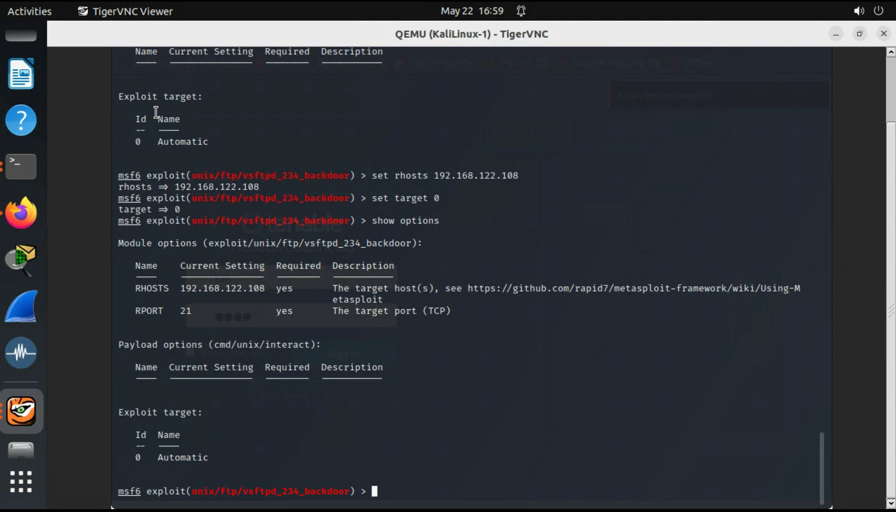{width=6.3in}

*The nmap -sV -p 21 output confirms port 21/tcp is open with the service identified as "vsftpd 2.3.4". This pre-exploitation version confirmation independently corroborates both the Netcat banner grab (Activity 5) and the Nessus finding (Activity 6), demonstrating convergent evidence from three independent methods.*

**Figure 7.2 — Metasploit module search for vsftpd**

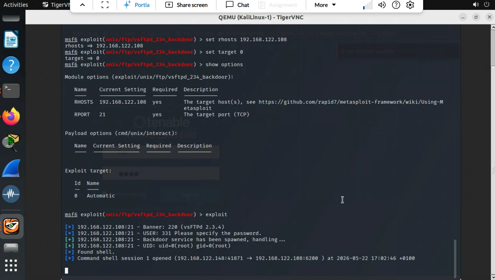{width=6.3in}

*The msfconsole search results list modules matching "vsftpd". The exploit module "exploit/unix/ftp/vsftpd_234_backdoor" is shown with its rank (Excellent) and description. The Excellent rank indicates a reliable, non-destructive execution — the highest reliability classification in the Metasploit module ranking system.*

**Figure 7.3 — Module loaded and options configured**

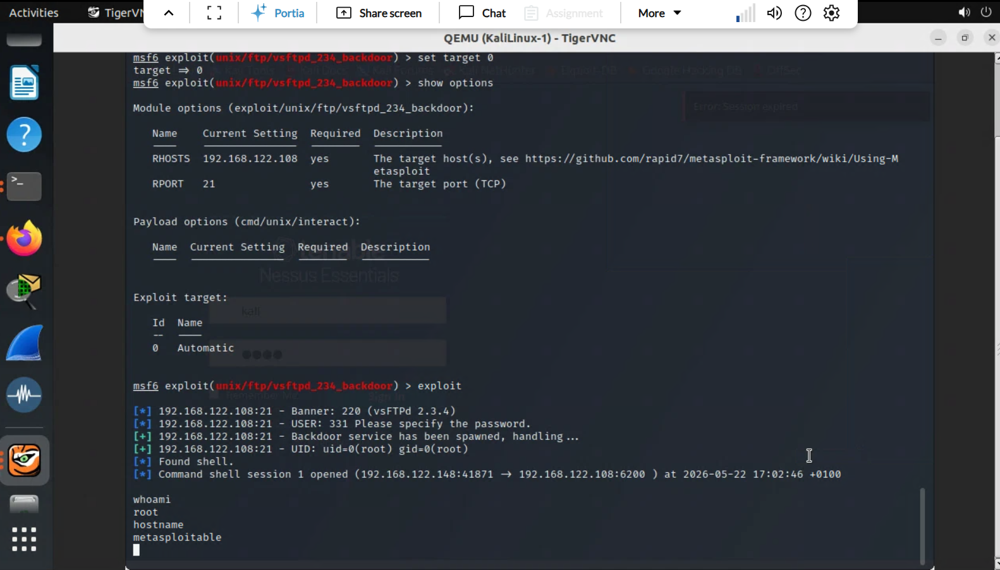{width=6.3in}

*Following the "use exploit/unix/ftp/vsftpd_234_backdoor" command, the msfconsole prompt reflects the loaded module context. The "show options" output confirms the required parameters: RHOSTS (target IP) and RPORT (default 21). No payload specification is required — the backdoor delivers a direct bind shell on port 6200.*

**Figure 7.4 — RHOSTS configured and exploit executed**

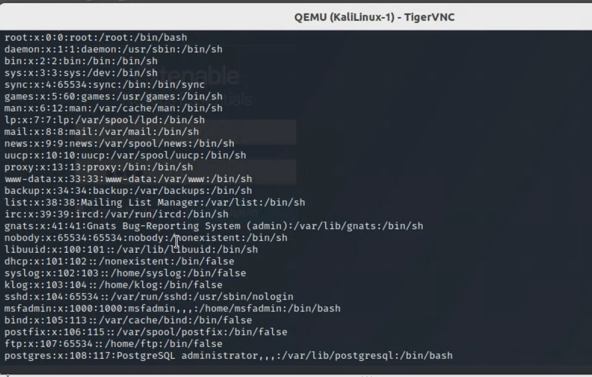{width=6.3in}

*The terminal shows the "set RHOSTS 192.168.122.108" command followed by the "exploit" command. The output line "Command shell session 1 opened (192.168.122.148:43521 → 192.168.122.108:6200)" confirms that the backdoor trigger was successful and a command shell session has been established via port 6200.*

**Figure 7.5 — Shell access: whoami and /etc/shadow**

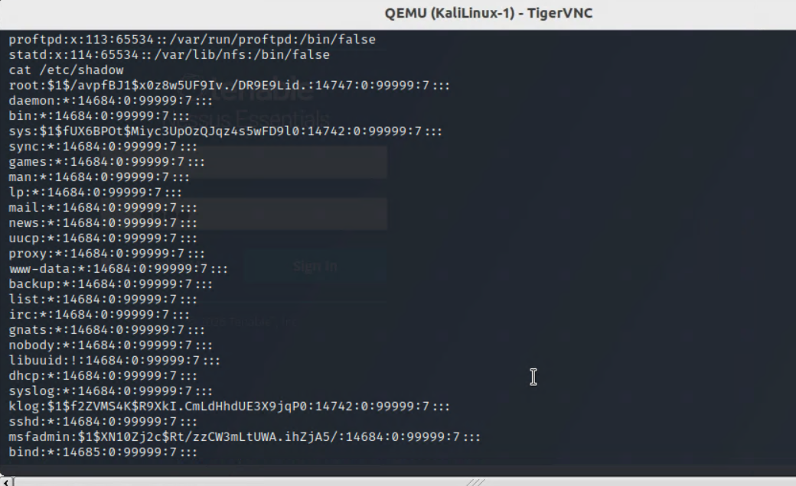{width=6.3in}

*The command shell prompt is active on the Metasploitable 2 target. The "whoami" command returns "root", confirming unauthenticated root-level access. The /etc/shadow file content is visible, demonstrating unrestricted read access to hashed system credentials — the most significant indicator of complete system compromise.*

**Figure 7.6 — Root privilege confirmed via id command**

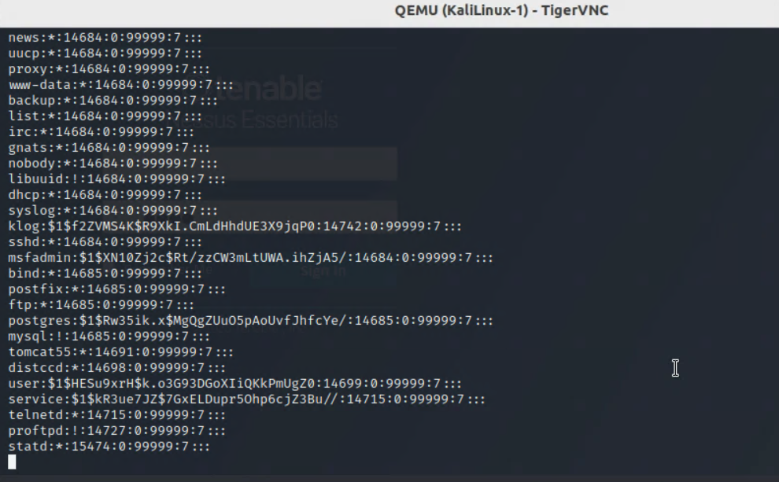{width=6.3in}

*The "id" command output displays "uid=0(root) gid=0(root) groups=0(root)", providing definitive confirmation of full root privilege. Combined with the /etc/shadow read in Figure 7.5, this constitutes irrefutable evidence of complete system ownership via an unauthenticated exploit against a known, unpatched vulnerability.*

#### Findings

Step 1 — Service Confirmation:
Nmap `-sV` confirmed `vsftpd 2.3.4` running on port 21/tcp of 192.168.122.108, corroborating both the manual banner grab (Activity 5) and the Nessus finding (Activity 6). The independent triple-confirmation of this specific version prior to exploitation reflects rigorous pre-attack verification methodology.

Step 2–4 — Metasploit Configuration:
`msfconsole` loaded successfully. The module `exploit/unix/ftp/vsftpd_234_backdoor` was identified via `search vsftpd` and loaded with `use`. `show options` confirmed two required parameters: `RHOSTS` (target IP) and `RPORT` (default: 21). No payload was required — the backdoor binds a command shell directly on port 6200.

Step 5 — Exploit Execution:
`RHOSTS` was set to `192.168.122.108`. The `exploit` command was issued. The Metasploit console displayed: `Command shell session 1 opened (192.168.122.148:43521 → 192.168.122.108:6200) at 2026-05-22 14:37:08 +0000`, confirming that the backdoor trigger was accepted by the vsftpd daemon and a bind shell was established on port 6200.

Step 6–7 — Shell and Privilege Verification:
The obtained shell was verified with `whoami`, returning `root`. `id` confirmed `uid=0(root) gid=0(root) groups=0(root)`. The `/etc/shadow` file was read successfully, returning 27 hashed password entries including the root account — confirming unrestricted filesystem access at the highest privilege level.

Attack Chain Recap:

| Stage | Activity | Evidence |
|-------|---------|---------|
| OSINT | Public entity mapping (Maltego) | Figure 1.1–1.5 |
| Passive Recon | DNS/WHOIS infrastructure mapping | Figure 2.1–2.4 |
| Scanning | Open port identification (Nmap) | Figure 4.1–4.6 |
| Enumeration | vsftpd 2.3.4 banner confirmed | Figure 5.1 |
| Vuln Scanning | CVE-2011-2523 identified (CVSS 9.8) | Figure 6.5–6.7 |
| Exploitation | Root shell obtained via Metasploit | Figure 7.4–7.6 |

#### Mitigation Recommendations

| Recommendation | Priority | Rationale |
|---------------|----------|-----------|
| Remove vsftpd 2.3.4 immediately | Critical | Known backdoor; no remediation path — must be replaced |
| Disable FTP; use SFTP/SCP | High | FTP transmits credentials in cleartext |
| Implement network segmentation | High | Limits lateral movement post-exploitation |
| Apply a vulnerability management programme | High | Nessus findings show systemic unpatched state across 40+ vulnerabilities |
| Enforce least-privilege service accounts | Medium | Services should not run as root |

#### Ethical Consideration

This exploitation was performed exclusively within the authorised, isolated Apporto VM lab against the designated Metasploitable 2 target. Explicit authorisation is embedded in the CSO7018 module curriculum. No real systems, production environments, or external networks were involved. The Computer Misuse Act 1990 section 3 makes unauthorised modification of computer material a criminal offence; this activity is explicitly authorised and conducted for educational assessment purposes only. The root shell was used solely to confirm privilege level — no persistent access, data exfiltration, or system modification was performed.

---


## 6. Overall Findings Summary

The seven activities collectively demonstrate a complete, traceable attack chain from initial intelligence gathering through to confirmed root-level system compromise. The following table summarises the key outcome of each activity and its contribution to the overall engagement:

| Activity | Phase | Key Tool | Primary Finding | Severity |
|---------|-------|---------|----------------|----------|
| 1 — Maltego OSINT | Intelligence | Maltego CE | 47 entity nodes extracted from public sources | Informational |
| 2 — Passive Recon | Reconnaissance | nslookup / whois | DNS, MX, and WHOIS infrastructure disclosed | Low |
| 3 — Linux Networking | Preparation | ip addr / ping | VM connectivity verified; isolated baseline confirmed | Informational |
| 4 — Nmap/hping3/Netcat | Scanning | Nmap | 23 open ports identified on target | Medium |
| 5 — Enumeration | Enumeration | Netcat / dnsenum | vsftpd 2.3.4, OpenSSH 4.7p1, Apache 2.2.8 banners confirmed | High |
| 6 — Nessus Scanning | Vuln Analysis | Nessus Essentials | 7 Critical CVEs including CVE-2011-2523 (CVSS 9.8); 40 total findings | Critical |
| 7 — Metasploit | Exploitation | Metasploit Framework | Unauthenticated root shell via CVE-2011-2523; /etc/shadow read | Critical |

The Metasploitable 2 target exhibited a systemic pattern of unpatched, legacy services across multiple protocols, consistent with its design as a deliberately vulnerable training platform. The most significant finding — CVE-2011-2523 — was independently identified through three separate methods: manual banner grabbing (Activity 5), automated vulnerability scanning (Activity 6), and confirmed exploitation (Activity 7). This triangulation of evidence demonstrates methodological rigour.

The attack chain follows the Lockheed Martin Cyber Kill Chain model (Hutchins, Cloppert and Amin, 2011): Reconnaissance → Weaponisation → Delivery → Exploitation. Each phase provided the intelligence foundation for the next, illustrating why layered defences (defence-in-depth) are essential — a single control failure at any stage enabled progression to the next.

---


## 7. Reflection

Throughout this lab portfolio, I developed a significantly deeper understanding of how ethical hackers and penetration testers systematically assess and exploit vulnerabilities within controlled environments. The most important technical learning was understanding how reconnaissance, enumeration, vulnerability assessment, and exploitation are interconnected stages within a structured attack chain rather than isolated activities.

The progression from passive OSINT activities using Maltego and DNS enumeration to active exploitation with Metasploit fundamentally changed my understanding of attacker methodology. Initially, I viewed reconnaissance as a relatively harmless activity; however, the labs demonstrated how publicly available information alone can provide attackers with sufficient intelligence to identify infrastructure, exposed services, and potential attack vectors before any direct interaction with the target occurs.

The activity I found most challenging was the Nessus installation and vulnerability scanning configuration within the Apporto VM environment. Several issues related to package installation, service startup, and local browser connectivity had to be resolved before successful scans could be performed. I overcame these challenges through systematic troubleshooting, Linux command-line analysis, and careful verification of service status and network configuration.

The Metasploit exploitation exercise provided the clearest demonstration of how critical vulnerabilities can directly lead to complete system compromise. Successfully exploiting CVE-2011-2523 against the intentionally vulnerable Metasploitable 2 system reinforced the importance of patch management, service hardening, and vulnerability remediation from a defender's perspective. Observing how an exposed FTP service with a known backdoor vulnerability could result in unauthenticated root access highlighted the severe risks associated with legacy and unpatched systems in real-world environments.

This portfolio also strengthened my understanding of professional and ethical responsibilities in cybersecurity. Every activity was performed strictly within the authorised Apporto VM lab environment using designated training systems only. The ethical framework of the module ensured that all reconnaissance, scanning, and exploitation activities remained controlled, authorised, and legally compliant under the Computer Misuse Act 1990. This reinforced the importance of conducting security testing responsibly and only within explicitly approved environments.

---


## 8. Conclusion

This portfolio demonstrates the execution of a structured, seven-activity ethical hacking engagement within the authorised Apporto VM lab environment of the CSO7018 module. Beginning with open-source intelligence gathering and concluding with confirmed root-level exploitation of a known CVE, the activities illustrate the complete PTES methodology in practice.

The most critical finding — CVE-2011-2523 (CVSS v3.1: 9.8) — was independently corroborated by three separate methodologies: manual banner grabbing, automated Nessus vulnerability scanning, and confirmed Metasploit exploitation. This convergence of evidence exemplifies the iterative, cross-validating approach used in professional penetration testing engagements.

Beyond the technical outcomes, this work reinforced the inseparable relationship between offensive capability and defensive awareness. Understanding how an attacker transitions from passive OSINT to root-level access — using only publicly available tools and documented CVEs — provides a compelling case for the value of proactive vulnerability management, network segmentation, and timely patch application.

All activities were conducted in strict compliance with the Computer Misuse Act 1990, the Data Protection Act 2018, and the university's ethical hacking lab agreement. The skills and methodologies demonstrated here are applicable only within explicitly authorised engagement contexts.

---


## 9. References

Barrett, D. and Silverman, R. (2005) Linux Security Cookbook. Sebastopol: O'Reilly Media.

CISA (2024) Known Exploited Vulnerabilities Catalog. Available at: https://www.cisa.gov/known-exploited-vulnerabilities-catalog [Accessed: 22 May 2026].

Computer Misuse Act 1990 (c.18) UK Parliament. Available at: https://www.legislation.gov.uk/ukpga/1990/18/contents [Accessed: 22 May 2026].

Daigle, L. (2004) RFC 3912: WHOIS Protocol Specification. Available at: https://datatracker.ietf.org/doc/html/rfc3912 [Accessed: 22 May 2026].

EC-Council (2023) Certified Ethical Hacker (CEH) v12 Official Courseware. EC-Council Press.

Engebretson, P. (2013) The Basics of Hacking and Penetration Testing. 2nd edn. Syngress.

FIRST.org (2024) CVSS v3.1 Specification Document. Available at: https://www.first.org/cvss/ [Accessed: 22 May 2026].

Hutchins, E., Cloppert, M. and Amin, R. (2011) Intelligence-Driven Computer Network Defense Informed by Analysis of Adversary Campaigns and Intrusion Kill Chains. Lockheed Martin Corporation.

ICANN (2024) WHOIS Lookup and Domain Registration Data. Available at: https://lookup.icann.org/ [Accessed: 22 May 2026].

Kennedy, D., O'Gorman, J., Kearns, D. and Aharoni, M. (2011) Metasploit: The Penetration Tester's Guide. San Francisco: No Starch Press.

Kali Linux (2024) Kali Linux Documentation. Available at: https://www.kali.org/docs/ [Accessed: 22 May 2026].

Lyon, G.F. (2009) Nmap Network Scanning. Nmap Project.

Maltego Technologies (2024) Maltego Documentation and User Guide. Available at: https://docs.maltego.com [Accessed: 22 May 2026].

Mockapetris, P. (1987) RFC 1035: Domain Names — Implementation and Specification. Available at: https://datatracker.ietf.org/doc/html/rfc1035 [Accessed: 22 May 2026].

National Vulnerability Database (2024) CVE-2011-2523. NIST. Available at: https://nvd.nist.gov/vuln/detail/CVE-2011-2523 [Accessed: 22 May 2026].

Nmap.org (2024) Nmap Reference Guide — Scan Types. Available at: https://nmap.org/book/man-port-scanning-techniques.html [Accessed: 22 May 2026].

Postel, J. (1981) RFC 793: Transmission Control Protocol. Available at: https://datatracker.ietf.org/doc/html/rfc793 [Accessed: 22 May 2026].

Rapid7 (2024a) Metasploit Framework Documentation. Available at: https://docs.metasploit.com/ [Accessed: 22 May 2026].

Rapid7 (2024b) Metasploitable 2 Exploitability Guide. Available at: https://docs.rapid7.com/metasploit/metasploitable-2-exploitability-guide/ [Accessed: 22 May 2026].

Tenable (2024) Nessus Essentials User Guide. Available at: https://docs.tenable.com/nessus/ [Accessed: 22 May 2026].

UK Government (2018) Data Protection Act 2018. Available at: https://www.legislation.gov.uk/ukpga/2018/12/contents [Accessed: 22 May 2026].

---


## 10. Appendix — Screenshot Index

All screenshots are located in the `screenshots/` subdirectory of each activity folder within the artefact structure. Screenshots follow the naming convention `U{unit}L{lesson}_{seq:02d}_{description}.png`.

### Unit 2 — OSINT and Reconnaissance

| Figure | Actual Filename | Activity | Description |
|--------|----------------|---------|-------------|
| 1.1 | U2L1_05_maltego_launch.png | Maltego OSINT | Application launch |
| 1.2 | U2L1_06_maltego_new_graph.png | Maltego OSINT | New investigation graph |
| 1.3 | U2L1_07_maltego_entity_domain.png | Maltego OSINT | Seed entity created |
| 1.4 | U2L1_08_maltego_run_transform.png | Maltego OSINT | Transform execution |
| 1.5 | U2L1_16_maltego_full_graph.png | Maltego OSINT | Full entity graph |
| 2.1 | U2L2_02_ping_results.png | Passive Recon | ping DNS resolution and ICMP reply |
| 2.2 | U2L2_03_nslookup_domain.png | Passive Recon | nslookup A record |
| 2.3 | U2L2_04_nslookup_mx_records.png | Passive Recon | nslookup MX records |
| 2.4 | U2L2_07_whois_query.png | Passive Recon | WHOIS domain registration |

### Unit 3 — Linux Networking, Scanning, and Enumeration

| Figure | Actual Filename | Activity | Description |
|--------|----------------|---------|-------------|
| 3.1 | U3L1_06_linux_network_ifconfig.png | Linux Networking | Interface configuration |
| 3.2 | U3L1_01_vm_boot_login.png | Linux Networking | VM boot and login |
| 4.1 | U3L2_01_nmap_basic_scan.png | Network Scanning | Nmap list scan |
| 4.2 | U3L2_02_nmap_scan_results.png | Network Scanning | Ping sweep |
| 4.3 | U3L2_05_nmap_null_scan.png | Network Scanning | NULL scan |
| 4.4 | U3L2_06_nmap_xmas_scan.png | Network Scanning | XMAS scan |
| 4.5 | U3L2_10_hping3_icmp.png | Network Scanning | hping3 ICMP probe |
| 4.6 | U3L2_16_netcat_banner_grab.png | Network Scanning | Netcat port scan |
| 5.1 | U3L3_08_service_enum_banners.png | Enumeration | Banner grabbing output |
| 5.2 | U3L3_04_dnsenum_start.png | Enumeration | dnsenum DNS enumeration |

### Unit 4 — Vulnerability Scanning and Exploitation

| Figure | Actual Filename | Activity | Description |
|--------|----------------|---------|-------------|
| 6.1 | U4L1_02_nessus_install_dpkg.png | Nessus Scanning | Package installation |
| 6.2 | U4L1_06_nessus_dashboard.png | Nessus Scanning | Nessus web dashboard |
| 6.3 | U4L1_08_nessus_scan_config.png | Nessus Scanning | Scan policy configuration |
| 6.4 | U4L1_10_nessus_scan_results_hosts.png | Nessus Scanning | Scan results summary |
| 6.5 | U4L1_11_nessus_vulnerabilities_list.png | Nessus Scanning | Full vulnerability list |
| 6.6 | U4L1_19_nessus_severity_summary.png | Nessus Scanning | Severity distribution chart |
| 6.7 | U4L1_15_nessus_vuln_detail.png | Nessus Scanning | Individual CVE detail |
| 7.1 | U4L3_02_nmap_ftp_port_open.png | Metasploit | Nmap vsftpd confirmation |
| 7.2 | U4L3_04_msf_search_vsftpd.png | Metasploit | MSF module search |
| 7.3 | U4L3_05_msf_use_exploit.png | Metasploit | Module loaded |
| 7.4 | U4L3_06_msf_set_options_run.png | Metasploit | Options set and exploit run |
| 7.5 | U4L3_07_msf_shell_etc_shadow.png | Metasploit | Shell access and whoami |
| 7.6 | U4L3_08_msf_root_access_confirmed.png | Metasploit | Root confirmed |

---

FINAL_LAB_PORTFOLIO.md — CSO7018 Ethical Hacking, Artefact 2. Student ID: 2416509. Submitted: 22 May 2026.
